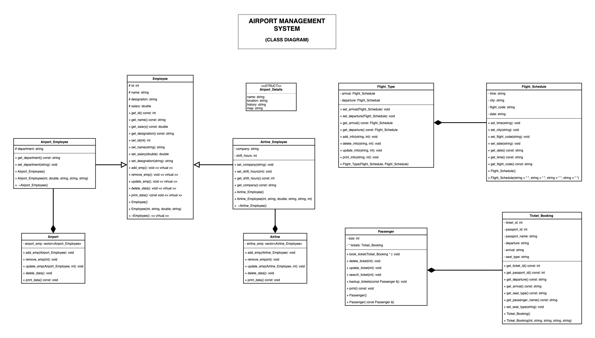

# Airport Management System

## Table of Contents
- [Introduction](#introduction)
- [Features](#features)
- [Technologies Used](#technologies-used)
- [Class Diagram](#class-diagram)
- [Key Components](#key-components)
- [Project Structure](#project-structure)
- [Contributing](#contributing)
- [License](#license)

---

## Introduction
The **Airport Management System** is a comprehensive application designed to streamline and manage various operations within an airport. It covers employee management, flight scheduling, ticket booking, and passenger interactions, ensuring efficient airport operations. This system is structured to handle complex relationships between employees, flights, schedules, and bookings while maintaining high scalability and ease of use.

---

## Features
- **Employee Management**: Manage airport and airline employees, including adding, updating, and deleting records.
- **Flight Scheduling**: Set and manage flight arrival and departure schedules.
- **Ticket Booking**: Allow passengers to book and manage tickets with ease.
- **Passenger Management**: Track passenger details and ticket bookings.
- **Detailed Class Diagram**: The system is structured with clear relationships among various entities.
- **Modular Design**: Ensures scalability and easy maintainability.

---

## Technologies Used
- **Programming Language**: C++ (Object-Oriented Programming)
- **Tools**: UML (Unified Modeling Language) for designing the class diagram
- **Database**: SQL for managing backend data (if applicable)

---

## Class Diagram
The class diagram represents the structural design of the Airport Management System. It showcases the relationships between various entities such as employees, flights, passengers, and ticket bookings.

  
*Figure 1: Class Diagram of Airport Management System*

---

## Key Components

### 1. **Employee**
- **Attributes**: `id`, `name`, `designation`, `salary`
- **Methods**:
  - Manage employee details (add, remove, update).
  - Virtual methods for extensibility.

### 2. **Airport Employee** (inherits from `Employee`)
- **Additional Attribute**: `department`
- **Role**: Handles airport-specific operations.

### 3. **Airline Employee** (inherits from `Employee`)
- **Additional Attributes**: `company`, `shift_hours`
- **Role**: Handles airline-specific operations.

### 4. **Airport**
- **Attributes**: `airport_emp` (list of employees)
- **Methods**:
  - Add, update, and delete employee records.
  - Manage overall airport operations.

### 5. **Airline**
- **Attributes**: `airline_emp` (list of employees)
- **Methods**:
  - Similar to `Airport`, manages airline-specific employees.

### 6. **Flight Schedule**
- **Attributes**: `time`, `city`, `flight_code`, `date`
- **Methods**: Manage flight timings, cities, and schedules.

### 7. **Flight Type**
- **Attributes**: Manages flight arrival and departure schedules.
- **Methods**:
  - Add or delete information related to flight schedules.

### 8. **Passenger**
- **Attributes**: `size` (number of passengers), `tickets` (list of booked tickets)
- **Methods**:
  - Book, delete, and search tickets.
  - Handle passenger details.

### 9. **Ticket Booking**
- **Attributes**: `ticket_id`, `passport_id`, `passport_name`, `departure`, `arrival`, `seat_type`
- **Methods**:
  - Manage all ticket details, including seat types and passenger information.

---

## Contributing
Contributions to this project are welcome! If you'd like to add new features, fix issues, or improve the documentation:
1. Fork the repository.
2. Make your changes.
3. Submit a pull request for review.

---

## License
This project is licensed under the **MIT License**. For more details, refer to the [LICENSE](LICENSE) file.

---

*Created by M. Hasnain Saleem*
